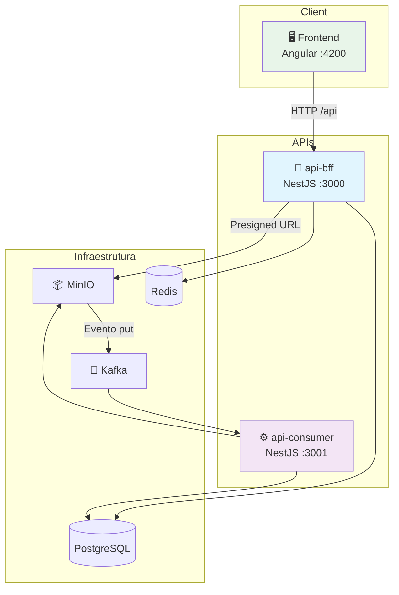
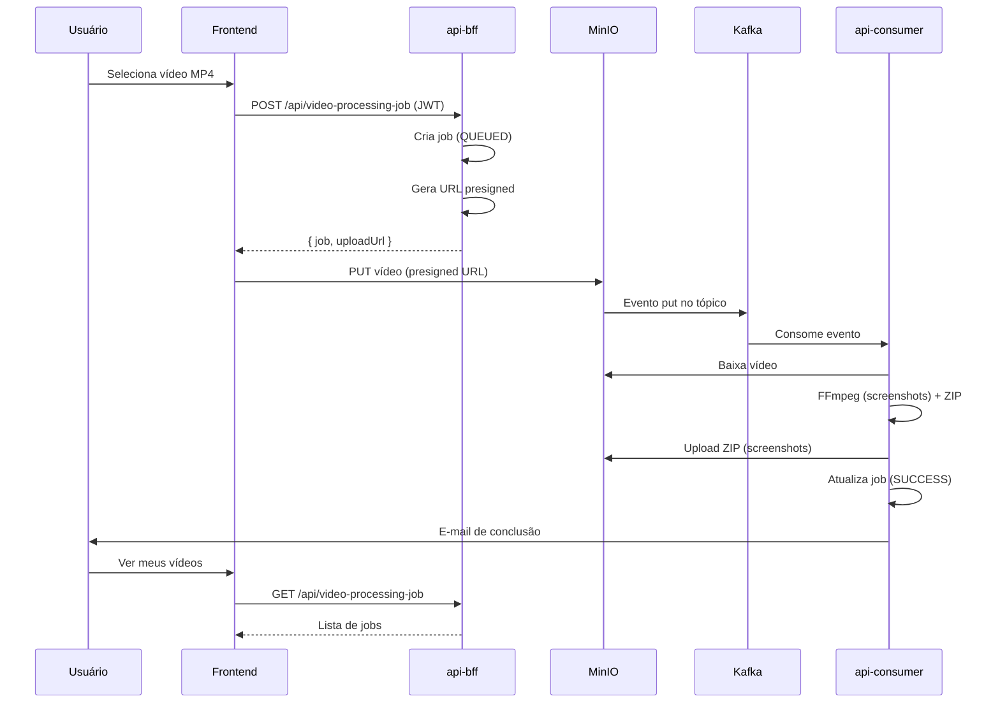

# 🎬 Video Screenshot Generator

## ▶️ Apresentação

- [Vídeo](https://youtu.be/0TpF8UJVnN4)

## 👥 Equipe - Grupo 211

- davidasteixeira
- Gabriel Sahdo - RM364903
- Rafael - RM363594
- Thiago Luiz - RM364455

## 📖 Visão Geral

Aplicação para upload de vídeos MP4, geração automática de screenshots via FFmpeg e armazenamento em MinIO. Microserviços com **api-bff** (Backend for Frontend), **api-consumer** (processamento assíncrono via Kafka) e **frontend** Angular.

Este README é um **overview geral**. Arquitetura, escalabilidade e funcionalidades detalhadas estão nos READMEs internos de cada aplicação e pasta.

## 🏛️ Arquitetura

### Serviços e Comunicação



### Fluxo de Comunicação entre Serviços



## 🚀 Como Executar

### Pré-requisitos

- Docker e Docker Compose
- Arquivo `.env` na raiz (copiar de `.env.example`)

### Subir toda a aplicação

```bash
# Na raiz do projeto
docker compose up -d --build
```

Aguarde os containers iniciarem. Acesse:

- **Frontend:** http://localhost:4200
- **api-bff:** http://localhost:3000
- **api-consumer (Swagger):** http://localhost:3001/docs
- **Grafana:** http://localhost:3005

## 📁 Documentação

Resumo do que cada documentação cobre:

| Documento                                         | Resumo                                          |
| ------------------------------------------------- | ----------------------------------------------- |
| [infra/](infra/README.md)                         | Database, MinIO, Grafana, Kubernetes            |
| [api-bff](projects/api-bff/README.md)             | BFF, auth, jobs, storage, cache                 |
| [api-consumer](projects/api-consumer/README.md)   | Consumidor Kafka, FFmpeg, arquitetura hexagonal |
| [frontend](projects/frontend/README.md)           | Angular 17, Ng-Zorro, upload, rotas             |
| [docs/BACKEND](docs/BACKEND.md)                   | Fluxo, APIs, Swagger                            |
| [docs/API-E-FRONTEND](docs/API-E-FRONTEND.md)     | Integração frontend com API                     |
| [docs/PORTAS-E-SWAGGER](docs/PORTAS-E-SWAGGER.md) | Portas e URLs dos serviços                      |
